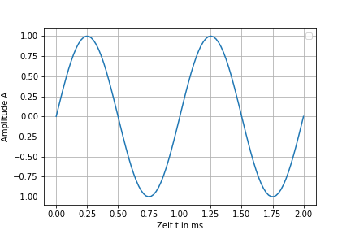
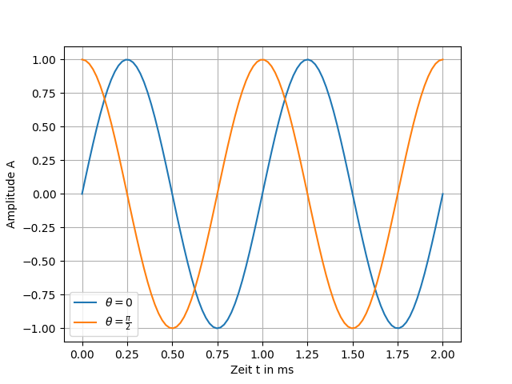



==============

==============

Übersetzungen für ==============
[ English -> Deutsch ]

==============
    ==============





The objective of this lab activity is to understand what is meant by

Das Ziel dieser Laboraktivität ist es zu verstehen, was gemeint ist

Übersetzungen für The objective of this lab activity is to understand what is meant by
[ English -> Deutsch ]

The objective of this lab activity is to understand what is meant by
    Das Ziel dieser Laboraktivität ist es zu verstehen, was gemeint ist, Das Ziel dieser Labortätigkeit ist zu verstehen, was gemeint ist mit

the phase relationship between signals and to see how well theory

die Phasenbeziehung zwischen Signalen und um zu sehen, wie gut Theorie

Übersetzungen für the phase relationship between signals and to see how well theory
[ English -> Deutsch ]

the phase relationship between signals and to see how well theory
    die Phasenbeziehung zwischen Signalen und um zu sehen, wie gut Theorie, die Phasenbeziehung zwischen den Signalen und wie gut Theorie zu sehen

agrees with practice. A secondary outcome will be a preliminary

stimmt mit der Praxis überein. Ein sekundäres Ergebnis wird eine vorläufige sein

Übersetzungen für agrees with practice. A secondary outcome will be a preliminary
[ English -> Deutsch ]

agrees with practice.
    stimmt mit der Praxis überein., stimmt mit der Praxis.
A secondary outcome will be a preliminary
    Ein sekundäres Ergebnis wird eine vorläufige sein

understanding of the Red Pitaya STEMlab hardware and software - test &

Verständnis der Red Pitaya STEMlab Hardware und Software - Test &

Übersetzungen für understanding of the Red Pitaya STEMlab hardware and software - test &
[ English -> Deutsch ]

understanding of the Red Pitaya STEMlab hardware and software - test &
    Verständnis der Red Pitaya STEMlab Hardware und Software - Test &, Verständnis des Red Pitaya STEMlab Hard- und Software - Test &

measurements applications.

Messungen Anwendungen.

Übersetzungen für measurements applications.
[ English -> Deutsch ]

measurements applications.
    Messungen Anwendungen.

Notes

Anmerkungen

Definitionen von Notes
[ English -> Deutsch ]

Substantiv
    (der) Aufzeichnungen
        records, notes, log, lecture notes
    (das) Konzept
        concept, plan, program, draft, notes, rough copy

Notes
    Anmerkungen, Notizen, Aufzeichnungen, Hinweise

-----

-----

Übersetzungen für -----
[ English -> Deutsch ]

-----
    -----



.. _hardware: http://redpitaya.readthedocs.io/en/latest/doc/developerGuide/125-10/top.html

..hardware: http://redpitaya.readthedocs.io/en/latest/doc/developerGuide/125-10/top.html

Übersetzungen für .. _hardware: http://redpitaya.readthedocs.io/en/latest/doc/developerGuide/125-10/top.html
[ English -> Deutsch ]

.. _hardware: http://redpitaya.readthedocs.io/en/latest/doc/developerGuide/125-10/top.html
    ..hardware: http://redpitaya.readthedocs.io/en/latest/doc/developerGuide/125-10/top.html, .. _hardware: http://redpitaya.readthedocs.io/en/latest/doc/developerGuide/125-10/top.html

In this tutorials we use the terminology taken from the user manual

In diesen Tutorials verwenden wir die Terminologie aus dem Benutzerhandbuch

Übersetzungen für In this tutorials we use the terminology taken from the user manual
[ English -> Deutsch ]

In this tutorials we use the terminology taken from the user manual
    In diesen Tutorials verwenden wir die Terminologie aus dem Benutzerhandbuch, In diesem Tutorials verwenden wir die Terminologie aus der Bedienungsanleitung entnommen

when referring to the connections to the Red Pitaya STEMlab board

wenn man sich auf die Verbindungen zum Red Pitaya STEMlab Board bezieht

Übersetzungen für when referring to the connections to the Red Pitaya STEMlab board
[ English -> Deutsch ]

when referring to the connections to the Red Pitaya STEMlab board
    wenn man sich auf die Verbindungen zum Red Pitaya STEMlab Board bezieht, wenn es um die Verbindungen zu dem Red Pitaya STEMlab Bord

hardware_.
/ˈhärdˌwe(ə)r/

Hardware_.

Definitionen von hardware_.
[ English -> Deutsch ]

Adjektiv
    Hardware-
        hardware

Substantiv
    (die) Hardware
        hardware
    (die) Eisenwaren
        hardware, ironmongery
    (der) Haushaltswaren
        household goods, hardware
    (die) Kanone
        cannon, gun, shooter
    (das) Wehrmaterial
        hardware, ordnance
    (das) Schießeisen
        shooting iron, hardware

hardware_.
    Hardware_.

Background

Hintergrund

Definitionen von Background
[ English -> Deutsch ]

Substantiv
    (der) Hintergrund
        background, backdrop, back, ground, backcloth
    (der) Untergrund
        subsoil, underground, substratum
    (die) Herkunft
        origin, ancestry, provenance, background, birth, extraction
    (die) Kulisse
        backdrop, scenery, scene, mise-en-scene
    (der) Fond
        rear, back, background, foundation
    (die) Verhältnisse
        conditions, circumstances, situation, background
    (die) Umstände
        circumstances, trouble, setup, fuss, background, bother

Background
    Hintergrund

----------

----------

Übersetzungen für ----------
[ English -> Deutsch ]

----------
    ----------

We will investigate the concept of phase by looking at sine waves and

Wir werden das Konzept der Phase untersuchen, indem wir die Sinuswellen und betrachten

Übersetzungen für We will investigate the concept of phase by looking at sine waves and
[ English -> Deutsch ]

We will investigate the concept of phase by looking at sine waves and
    Wir werden das Konzept der Phase untersuchen, indem wir die Sinuswellen und betrachten, Wir werden das Konzept der Phase untersuchen, indem ich Sinuswellen suchen und

passive components that will allow us to observe phase shift with real

passive Komponenten, mit denen wir die Phasenverschiebung mit real beobachten können

Übersetzungen für passive components that will allow us to observe phase shift with real
[ English -> Deutsch ]

passive components that will allow us to observe phase shift with real
    passive Komponenten, mit denen wir die Phasenverschiebung mit real beobachten können, passive Komponenten, die uns Phasenverschiebung ermöglicht es mit realem zu beobachten

signals. First we will look at a sin wave and the phase term in the

Signale. Zuerst betrachten wir eine Sinuswelle und den Phasenterm in der

Übersetzungen für signals. First we will look at a sin wave and the phase term in the
[ English -> Deutsch ]

signals.
    Signale.
First we will look at a sin wave and the phase term in the
    Zuerst betrachten wir eine Sinuswelle und den Phasenterm in der, Zuerst werden wir mit einer Sinuswelle aussehen und der Phasenterm in der

argument. You should be familiar with the equation:

Streit. Sie sollten mit der Gleichung vertraut sein:

Übersetzungen für argument. You should be familiar with the equation:
[ English -> Deutsch ]

argument.
    Streit., Argument.
You should be familiar with the equation:
    Sie sollten mit der Gleichung vertraut sein:

.. math::
/maTH/

.. Mathematik::

Definitionen von .. math::
[ English -> Deutsch ]

Substantiv
    (die) Mathe
        math

.. math::
    .. Mathematik::, .. Mathe ::, .. :: math



f(t) = \sin(\omega t + \theta)

f (t) = \ sin (\ omega t + \ theta)

Übersetzungen für f(t) = \sin(\omega t + \theta)
[ English -> Deutsch ]

f(t) = \sin(\omega t + \theta)
    f (t) = \ sin (\ omega t + \ theta)

:math:`\omega` sets the frequency of the sinusoidal wave as :math:`t`

: math: `\ omega` setzt die Frequenz der Sinuswelle als: math:` t`

Übersetzungen für :math:`\omega` sets the frequency of the sinusoidal wave as :math:`t`
[ English -> Deutsch ]

:math:`\omega` sets the frequency of the sinusoidal wave as :math:`t`
    : math: `\ omega` setzt die Frequenz der Sinuswelle als: math:` t`, : Math: `\ omega` die Frequenz der sinusförmigen Welle als Sätze: math:` t`

progresses and :math:`\theta` defines an offset in time which defines

fortschreitet und: math: `\ theta` definiert einen zeitlichen Versatz, der definiert

Übersetzungen für progresses and :math:`\theta` defines an offset in time which defines
[ English -> Deutsch ]

progresses and :math:`\theta` defines an offset in time which defines
    fortschreitet und: math: `\ theta` definiert einen zeitlichen Versatz, der definiert, und schreitet: math: `\ theta` ein in Zeitversatz definiert, die definiert,

a phase shift in the function.

eine Phasenverschiebung in der Funktion.

Übersetzungen für a phase shift in the function.
[ English -> Deutsch ]

a phase shift in the function.
    eine Phasenverschiebung in der Funktion.

The sine function results in values ranging from 1 to -1. First set

Die Sinusfunktion ergibt Werte von 1 bis -1. Erstes Set

Übersetzungen für The sine function results in values ranging from 1 to -1. First set
[ English -> Deutsch ]

The sine function results in values ranging from 1 to -1.
    Die Sinusfunktion ergibt Werte von 1 bis -1., Die Sinusfunktion Ergebnisse in Werten von 1 bis -1 reichen.
First set
    Erstes Set, Erster Satz

time variable :math:`t` equal to a constant, say 1. The argument,

Zeitvariable: math: `t` gleich einer Konstante, sagen wir 1. Das Argument,

Übersetzungen für time variable :math:`t` equal to a constant, say 1. The argument,
[ English -> Deutsch ]

time variable :math:`t` equal to a constant, say 1. The argument,
    Zeitvariable: math: `t` gleich einer Konstante, sagen wir 1. Das Argument,, Zeitvariable: math: `t` gleich einer Konstanten, sagen 1. Das Argument,

:math:`\omega t`, is now no longer a function of time. With

: math: `\ omega t`, ist jetzt nicht länger eine Funktion der Zeit. Mit

Übersetzungen für :math:`\omega t`, is now no longer a function of time. With
[ English -> Deutsch ]

:math:`\omega t`, is now no longer a function of time.
    : math: `\ omega t`, ist jetzt nicht länger eine Funktion der Zeit., : Math: `\ omega t`, ist nun nicht mehr eine Funktion der Zeit.
With
    Mit

:math:`\omega` in radians, :math:`\sin(\frac{\pi}{4}) \approx 0.7071`.

: math: `\ omega` im Bogenmaß,: math:` \ sin (\ frac {\ pi} {4}) \ ca. 0,7071`.

Übersetzungen für :math:`\omega` in radians, :math:`\sin(\frac{\pi}{4}) \approx 0.7071`.
[ English -> Deutsch ]

:math:`\omega` in radians, :math:`\sin(\frac{\pi}{4}) \approx 0.7071`.
    : math: `\ omega` im Bogenmaß,: math:` \ sin (\ frac {\ pi} {4}) \ ca. 0,7071`., : Math: `\ omega` im Bogenmaß: math:` \ sin (\ frac {\ pi} {4}) \ approx 0.7071`.

:math:`2\pi` radians equals :math:`360^{\circ}`, so

: math: `2 \ pi` radians ist gleich: math:` 360 ^ {\ circ} `, so

Übersetzungen für :math:`2\pi` radians equals :math:`360^{\circ}`, so
[ English -> Deutsch ]

:math:`2\pi` radians equals :math:`360^{\circ}`, so
    : math: `2 \ pi` radians ist gleich: math:` 360 ^ {\ circ} `, so, : Math: `2 \ pi` Radiant entspricht: math:` 360 ^ {\ circ} `, so

:math:`\frac{\pi}{4}` in radians corresponds to

: math: `\ frac {\ pi} {4}` im Bogenmaß entspricht

Übersetzungen für :math:`\frac{\pi}{4}` in radians corresponds to
[ English -> Deutsch ]

:math:`\frac{\pi}{4}` in radians corresponds to
    : math: `\ frac {\ pi} {4}` im Bogenmaß entspricht

:math:`45^{\circ}`; :math:`\sin(45^{\circ}) = 0.7071`, too.

: math: `45 ^ {\ circ}`; : math: `\ sin (45 ^ {\ circ}) = 0.7071` auch.

Übersetzungen für :math:`45^{\circ}`; :math:`\sin(45^{\circ}) = 0.7071`, too.
[ English -> Deutsch ]

:math:`45^{\circ}`;
    : math: `45 ^ {\ circ}`;
:math:`\sin(45^{\circ}) = 0.7071`, too.
    : math: `\ sin (45 ^ {\ circ}) = 0.7071` auch.



Now let :math:`t` vary with time like it normally does. When the value

Lassen Sie nun: math: `t` mit der Zeit variieren, wie es normalerweise der Fall ist. Wenn der Wert

Übersetzungen für Now let :math:`t` vary with time like it normally does. When the value
[ English -> Deutsch ]

Now let :math:`t` vary with time like it normally does.
    Lassen Sie nun: math: `t` mit der Zeit variieren, wie es normalerweise der Fall ist., Nun lassen: math: `T` mit der Zeit ändern, wie es normalerweise der Fall ist.
When the value
    Wenn der Wert

of :math:`\omega t` changes linearly with time it yields a sine wave

von: math: `\ omega t` ändert sich linear mit der Zeit ergibt es eine Sinuswelle

Übersetzungen für of :math:`\omega t` changes linearly with time it yields a sine wave
[ English -> Deutsch ]

of :math:`\omega t` changes linearly with time it yields a sine wave
    von: math: `\ omega t` ändert sich linear mit der Zeit ergibt es eine Sinuswelle, von: math: omega `\ t` ändert sich linear mit der Zeit eine Sinuswelle ergibt

as shown in Fig. 1. As :math:`\omega t` goes from 0 to :math:`2 \pi`

wie in Abb. 1. Wie: math: `\ omega t` geht von 0 bis: math:` 2 \ pi`

Übersetzungen für as shown in Fig. 1. As :math:`\omega t` goes from 0 to :math:`2 \pi`
[ English -> Deutsch ]

as shown in Fig. 1. As :math:`\omega t` goes from 0 to :math:`2 \pi`
    wie in Abb. 1. Wie: math: `\ omega t` geht von 0 bis: math:` 2 \ pi`, wie in Fig 1 gezeigt als:. math: `\ omega t` geht von 0 bis: math:` 2 \ pi`

the sine wave goes from 0 up to 1, down to -1 and back to 0. This is

die Sinuswelle geht von 0 bis 1, runter bis -1 und zurück bis 0. Das ist

Übersetzungen für the sine wave goes from 0 up to 1, down to -1 and back to 0. This is
[ English -> Deutsch ]

the sine wave goes from 0 up to 1, down to -1 and back to 0. This is
    die Sinuswelle geht von 0 bis 1, runter bis -1 und zurück bis 0. Das ist, die Sinuswelle geht von 0 bis 1, bis auf -1 und zurück auf 0. Dies ist

one cycle or one period, :math:`T`, of a sine wave. The x-axis is the

ein Zyklus oder eine Periode,: math: `T`, einer Sinuswelle. Die X-Achse ist die

Übersetzungen für one cycle or one period, :math:`T`, of a sine wave. The x-axis is the
[ English -> Deutsch ]

one cycle or one period, :math:`T`, of a sine wave.
    ein Zyklus oder eine Periode,: math: `T`, einer Sinuswelle., ein Zyklus oder eine Periode,: math: `T`, eine Sinuswelle.
The x-axis is the
    Die X-Achse ist die

time varying argument/angle, :math:`\omega t`, which varies from 0 to

Zeit variierendes Argument / Winkel,: math: `\ omega t`, das von 0 bis variiert

Übersetzungen für time varying argument/angle, :math:`\omega t`, which varies from 0 to
[ English -> Deutsch ]

time varying argument/angle, :math:`\omega t`, which varies from 0 to
    Zeit variierendes Argument / Winkel,: math: `\ omega t`, das von 0 bis variiert, zeitlich variierenden Argument / Winkel: math: `\ omega t`, die von 0 variiert

:math:`2\pi`.

: math: `2 \ pi`.

Übersetzungen für :math:`2\pi`.
[ English -> Deutsch ]

:math:`2\pi`.
    : math: `2 \ pi`.

The value of :math:`\theta` is 0 in the function plotted in

Der Wert von: math: `\ theta` ist 0 in der Funktion, die in gezeichnet wird

Übersetzungen für The value of :math:`\theta` is 0 in the function plotted in
[ English -> Deutsch ]

The value of :math:`\theta` is 0 in the function plotted in
    Der Wert von: math: `\ theta` ist 0 in der Funktion, die in gezeichnet wird, Der Wert: math: `\ theta` ist 0 in der Funktion aufgetragen in

Fig. 1. Since the :math:`sin(0) = 0` the plot starts at 0. This is a

Abb. 1. Seit dem: math: `sin (0) = 0 beginnt die Handlung bei 0. Dies ist a

Übersetzungen für Fig. 1. Since the :math:`sin(0) = 0` the plot starts at 0. This is a
[ English -> Deutsch ]

Fig. 1. Since the :math:`sin(0) = 0` the plot starts at 0. This is a
    Abb. 1. Seit dem: math: `sin (0) = 0 beginnt die Handlung bei 0. Dies ist a, Bild 1. Seit:. Math: `sin (0) = 0 'die Handlung beginnt bei 0. Dies ist ein

simple sine wave without offset in time, which means no phase

einfache Sinuswelle ohne zeitlichen Versatz, also keine Phase

Übersetzungen für simple sine wave without offset in time, which means no phase
[ English -> Deutsch ]

simple sine wave without offset in time, which means no phase
    einfache Sinuswelle ohne zeitlichen Versatz, also keine Phase, einfache Sinuswelle ohne zeitlich versetzt, die keine Phasen bedeutet

offset. Note that if we are using degrees :math:`\omega t`, in a range

Offset. Beachten Sie, dass bei Verwendung von Graden: math: `\ omega t` in einem Bereich

Übersetzungen für offset. Note that if we are using degrees :math:`\omega t`, in a range
[ English -> Deutsch ]

offset.
    Offset., versetzt.
Note that if we are using degrees :math:`\omega t`, in a range
    Beachten Sie, dass bei Verwendung von Graden: math: `\ omega t` in einem Bereich, Beachten Sie, dass, wenn wir Grad verwenden: math: `\ omega t`, in einem Bereich

from from 0 to :math:`2 \pi` or 0 to :math:`360^{\circ}` to yield the sine

von 0 bis: math: `2 \ pi` oder 0 bis: math:` 360 ^ {\ circ} `um den Sinus zu erhalten

Übersetzungen für from from 0 to :math:`2 \pi` or 0 to :math:`360^{\circ}` to yield the sine
[ English -> Deutsch ]

from from 0 to :math:`2 \pi` or 0 to :math:`360^{\circ}` to yield the sine
    von 0 bis: math: `2 \ pi` oder 0 bis: math:` 360 ^ {\ circ} `um den Sinus zu erhalten, von 0 bis: math: `2 \ pi` oder 0 bis: math:` 360 ^ {\ circ} `den Sinus ergeben

wave shown in Fig. 1.

Welle in Fig. 1 gezeigt.

Übersetzungen für wave shown in Fig. 1.
[ English -> Deutsch ]

wave shown in Fig. 1.
    Welle in Fig. 1 gezeigt., Welle in Fig. 1 dargestellt.

.. Abbildung :: img / Activity_01_Fig_01.png

Übersetzungen für .. figure:: img/Activity_01_Fig_01.png
[ English -> Deutsch ]

.. figure:: img/Activity_01_Fig_01.png
    .. Abbildung :: img / Activity_01_Fig_01.png, .. Figur :: img / Activity_01_Fig_01.png

:align: center

:im Zentrum anordnen

Übersetzungen für :align: center
[ English -> Deutsch ]

:align: center
    :im Zentrum anordnen, :zentrieren, : ausrichten: zentrieren, : Align: center



Figure 1: 2 cycles of :math:`\sin(t)`

Abbildung 1: 2 Zyklen von: math: `\ sin (t)`

Übersetzungen für Figure 1: 2 cycles of :math:`\sin(t)`
[ English -> Deutsch ]

Figure 1: 2 cycles of :math:`\sin(t)`
    Abbildung 1: 2 Zyklen von: math: `\ sin (t)`, Abbildung 1: 2 Zyklen: math: `\ sin (t)`



As a side note, what happens if :math:`\omega t > 2\pi`?

Als Randnotiz: Was passiert, wenn: math: `\ omega t> 2 \ pi`?

Übersetzungen für As a side note, what happens if :math:`\omega t > 2\pi`?
[ English -> Deutsch ]

As a side note, what happens if :math:`\omega t > 2\pi`?
    Als Randnotiz: Was passiert, wenn: math: `\ omega t> 2 \ pi`?, Als Randbemerkung, was passiert, wenn: math: `\ omega t> 2 \ pi`?

Enter :math:`2.5\pi` in a calculator and see for yourself. As you

Geben Sie: math: `2.5 \ pi` in einen Taschenrechner und sehen Sie selbst. Wie du

Übersetzungen für Enter :math:`2.5\pi` in a calculator and see for yourself. As you
[ English -> Deutsch ]

Enter :math:`2.5\pi` in a calculator and see for yourself.
    Geben Sie: math: `2.5 \ pi` in einen Taschenrechner und sehen Sie selbst., Geben Sie: math: `2.5 \ pi` in einem Rechner und sehen Sie selbst.
As you
    Wie du, wie Sie

should know, the sine function repeats every :math:`2\pi` radians or

sollte wissen, die Sinusfunktion wiederholt sich alle: math: `2 \ pi` Radiant oder

Übersetzungen für should know, the sine function repeats every :math:`2\pi` radians or
[ English -> Deutsch ]

should know, the sine function repeats every :math:`2\pi` radians or
    sollte wissen, die Sinusfunktion wiederholt sich alle: math: `2 \ pi` Radiant oder, wissen sollten, die Sinus-Funktion wiederholt sich alle: math: `2 \ pi` Radiant oder

:math:`360^{\circ}`. It is similar to subtracting :math:`2\pi(I)` radians

: math: `360 ^ {\ circ}`. Es ähnelt dem Subtrahieren: math: `2 \ pi (I)` radians

Übersetzungen für :math:`360^{\circ}`. It is similar to subtracting :math:`2\pi(I)` radians
[ English -> Deutsch ]

:math:`360^{\circ}`.
    : math: `360 ^ {\ circ}`.
It is similar to subtracting :math:`2\pi(I)` radians
    Es ähnelt dem Subtrahieren: math: `2 \ pi (I)` radians, Es ist ähnlich wie Subtraktion: math: `2 \ pi (I)` Radiant

from the argument where I is the largest integer that yields a

aus dem Argument, wo ich die größte Ganzzahl ist, die ein ergibt

Übersetzungen für from the argument where I is the largest integer that yields a
[ English -> Deutsch ]

from the argument where I is the largest integer that yields a
    aus dem Argument, wo ich die größte Ganzzahl ist, die ein ergibt, aus dem Argument in dem ich die größte ganze Zahl ist, dass ein ergibt

non-negative result.

nicht negatives Ergebnis.

Übersetzungen für non-negative result.
[ English -> Deutsch ]

non-negative result.
    nicht negatives Ergebnis., nicht-negatives Ergebnis.

What happens if we plot a second sine wave into Fig. 1 with the same

Was passiert, wenn wir eine zweite Sinuswelle mit derselben in Fig. 1 einzeichnen

Übersetzungen für What happens if we plot a second sine wave into Fig. 1 with the same
[ English -> Deutsch ]

What happens if we plot a second sine wave into Fig. 1 with the same
    Was passiert, wenn wir eine zweite Sinuswelle mit derselben in Fig. 1 einzeichnen, Was passiert, wenn wir eine zweite Sinuswelle in Fig plotten. 1 mit dem gleichen

:math:`\omega` value and :math:`\theta = 0`?

: math: `\ omega` value und: math:` \ theta = 0`?

Übersetzungen für :math:`\omega` value and :math:`\theta = 0`?
[ English -> Deutsch ]

:math:`\omega` value and :math:`\theta = 0`?
    : math: `\ omega` value und: math:` \ theta = 0`?, : Math: `\ omega` Wert und: math:` \ theta = 0 '?

We have another sine wave which lands on top of the first sine

Wir haben eine andere Sinuswelle, die auf dem ersten Sinus landet

Übersetzungen für We have another sine wave which lands on top of the first sine
[ English -> Deutsch ]

We have another sine wave which lands on top of the first sine
    Wir haben eine andere Sinuswelle, die auf dem ersten Sinus landet, Wir haben eine andere Sinuswelle, die auf der Oberseite des ersten Sinus landet

wave. Since :math:`\theta = 0` there is no phase difference between

Welle. Da: math: `\ theta = 0 'gibt es keine Phasendifferenz zwischen

Übersetzungen für wave. Since :math:`\theta = 0` there is no phase difference between
[ English -> Deutsch ]

wave.
    Welle.
Since :math:`\theta = 0` there is no phase difference between
    Da: math: `\ theta = 0 'gibt es keine Phasendifferenz zwischen, Seit: math: `\ theta = 0 'gibt es keine Phasendifferenz zwischen

the sine waves and they look the same in time.

die Sinuswellen und sie sehen in der Zeit gleich aus.

Übersetzungen für the sine waves and they look the same in time.
[ English -> Deutsch ]

the sine waves and they look the same in time.
    die Sinuswellen und sie sehen in der Zeit gleich aus., die Sinuswellen und sie gleich aussehen, in der Zeit.

Now alter :math:`\theta` to :math:`\pi / 2` rad or :math:`90^{\circ}` for

Jetzt ändere: math: `\ theta` zu: math:` \ pi / 2` rad oder: math: `90 ^ {\ circ}` für

Übersetzungen für Now alter :math:`\theta` to :math:`\pi / 2` rad or :math:`90^{\circ}` for
[ English -> Deutsch ]

Now alter :math:`\theta` to :math:`\pi / 2` rad or :math:`90^{\circ}` for
    Jetzt ändere: math: `\ theta` zu: math:` \ pi / 2` rad oder: math: `90 ^ {\ circ}` für, Jetzt ändern: math: `\ theta` zu: math:` \ pi / 2 `rad oder: math:` 90 ^ {\ circ} `für

the second sine wave. We see the original sine wave and a second sine

die zweite Sinuswelle. Wir sehen die ursprüngliche Sinuswelle und einen zweiten Sinus

Übersetzungen für the second sine wave. We see the original sine wave and a second sine
[ English -> Deutsch ]

the second sine wave.
    die zweite Sinuswelle.
We see the original sine wave and a second sine
    Wir sehen die ursprüngliche Sinuswelle und einen zweiten Sinus, Wir sehen die ursprüngliche Sinuswelle und eine zweite Sinus

wave shifted to the left in time. Fig. 2 shows the original sine wave

Welle nach links verschoben. Fig. 2 zeigt die ursprüngliche Sinuswelle

Übersetzungen für wave shifted to the left in time. Fig. 2 shows the original sine wave
[ English -> Deutsch ]

wave shifted to the left in time.
    Welle nach links verschoben., Welle zeitlich verschoben nach links.
Fig. 2 shows the original sine wave
    Fig. 2 zeigt die ursprüngliche Sinuswelle, Fig. 2 zeigt das ursprüngliche Sinuswellen

(green) and the second sine wave (orange) with an offset in

(grün) und die zweite Sinuswelle (orange) mit einem Offset in

Übersetzungen für (green) and the second sine wave (orange) with an offset in
[ English -> Deutsch ]

(green) and the second sine wave (orange) with an offset in
    (grün) und die zweite Sinuswelle (orange) mit einem Offset in, (Grün) und die zweite Sinuswelle (orange) mit einem Versatz in

time. Since the offset is constant, we see the original sine wave

Zeit. Da der Offset konstant ist, sehen wir die ursprüngliche Sinuswelle

Übersetzungen für time. Since the offset is constant, we see the original sine wave
[ English -> Deutsch ]

time.
    Zeit.
Since the offset is constant, we see the original sine wave
    Da der Offset konstant ist, sehen wir die ursprüngliche Sinuswelle, Da der Versatz konstant ist, sehen wir die ursprüngliche Sinuswelle

shifted in time by a value of :math:`\theta` which is :math:`1/4` of

zeitlich um einen Wert von: math: `\ theta` verschoben, was: math:` 1 / 4` von

Übersetzungen für shifted in time by a value of :math:`\theta` which is :math:`1/4` of
[ English -> Deutsch ]

shifted in time by a value of :math:`\theta` which is :math:`1/4` of
    zeitlich um einen Wert von: math: `\ theta` verschoben, was: math:` 1 / 4` von, verschoben in der Zeit um einen Wert von: math: `\ theta` welche ist: math:` 1 / 4` von

the period in this example.

der Zeitraum in diesem Beispiel.

Übersetzungen für the period in this example.
[ English -> Deutsch ]

the period in this example.
    der Zeitraum in diesem Beispiel., die Zeit, in diesem Beispiel.

.. Abbildung :: img / Activity_01_Fig_02.png

Übersetzungen für .. figure:: img/Activity_01_Fig_02.png
[ English -> Deutsch ]

.. figure:: img/Activity_01_Fig_02.png
    .. Abbildung :: img / Activity_01_Fig_02.png, .. Figur :: img / Activity_01_Fig_02.png

:align: center

:im Zentrum anordnen

Übersetzungen für :align: center
[ English -> Deutsch ]

:align: center
    :im Zentrum anordnen, :zentrieren, : ausrichten: zentrieren, : Align: center

Figure 2: green - :math:`\sin(t)`,  orange - :math:`\sin(t + \pi/4)`.

Abbildung 2: grün -: math: `\ sin (t)`, orange -: math: `\ sin (t + \ pi / 4)`.

Übersetzungen für Figure 2: green - :math:`\sin(t)`,  orange - :math:`\sin(t + \pi/4)`.
[ English -> Deutsch ]

Figure 2: green - :math:`\sin(t)`,  orange - :math:`\sin(t + \pi/4)`.
    Abbildung 2: grün -: math: `\ sin (t)`, orange -: math: `\ sin (t + \ pi / 4)`.

:math:`\theta` is time offset or phase portion of Eq. (1).

: math: `\ theta` ist Zeitverschiebung oder Phasenanteil von Gl. (1).

Übersetzungen für :math:`\theta` is time offset or phase portion of Eq. (1).
[ English -> Deutsch ]

:math:`\theta` is time offset or phase portion of Eq.
    : math: `\ theta` ist Zeitverschiebung oder Phasenanteil von Gl., : Math: `\ theta` ist Zeitversatz oder Phasenabschnitt von Gl.
(1).
    (1).

The phase angle defines offset in time and vice versa. Eq. (2) shows

Der Phasenwinkel definiert den zeitlichen Versatz und umgekehrt. Gl. (2) zeigt

Übersetzungen für The phase angle defines offset in time and vice versa. Eq. (2) shows
[ English -> Deutsch ]

The phase angle defines offset in time and vice versa.
    Der Phasenwinkel definiert den zeitlichen Versatz und umgekehrt., Der Phasenwinkel definiert, in der Zeit und umgekehrt versetzt.
Eq.
    Gl.
(2) shows
    (2) zeigt, (2) zeigt,

the relationship. We happened to choose a particularly common

die Beziehung. Wir haben zufällig ein besonders häufig gewählt

Übersetzungen für the relationship. We happened to choose a particularly common
[ English -> Deutsch ]

the relationship.
    die Beziehung., das Verhältnis.
We happened to choose a particularly common
    Wir haben zufällig ein besonders häufig gewählt, Wir sind durch Zufall eine besonders häufig wählen

offset of :math:`90^{\circ}`. The phase offset between a sine wave and

Offset von: math: `90 ^ {\ circ}`. Der Phasenversatz zwischen einer Sinuswelle und

Übersetzungen für offset of :math:`90^{\circ}`. The phase offset between a sine wave and
[ English -> Deutsch ]

offset of :math:`90^{\circ}`.
    Offset von: math: `90 ^ {\ circ}`.
The phase offset between a sine wave and
    Der Phasenversatz zwischen einer Sinuswelle und

cosine wave is :math:`90^{\circ}`. The offset angle is almost always

Kosinuswelle ist: math: `90 ^ {\ circ}`. Der Versatzwinkel ist fast immer

Übersetzungen für cosine wave is :math:`90^{\circ}`. The offset angle is almost always
[ English -> Deutsch ]

cosine wave is :math:`90^{\circ}`.
    Kosinuswelle ist: math: `90 ^ {\ circ}`.
The offset angle is almost always
    Der Versatzwinkel ist fast immer

not 90. As a matter of fact it is often a function of frequency (:math:`f`).

nicht 90. In der Tat ist es oft eine Funktion der Häufigkeit (: math: `f`).

Übersetzungen für not 90. As a matter of fact it is often a function of frequency (:math:`f`).
[ English -> Deutsch ]

not 90. As a matter of fact it is often a function of frequency (:math:`f`).
    nicht 90. In der Tat ist es oft eine Funktion der Häufigkeit (: math: `f`)., nicht 90. Wie in der Tat ist es oft eine Funktion der Frequenz (: math: `f`).

When there are two sine waves, e.g. displayed on a scope, the phase

Wenn zwei Sinuswellen vorhanden sind, z.B. Auf einem Scope wird die Phase angezeigt

Übersetzungen für When there are two sine waves, e.g. displayed on a scope, the phase
[ English -> Deutsch ]

When there are two sine waves, e.g.
    Wenn zwei Sinuswellen vorhanden sind, z.B., Wenn zwei Sinuswellen, z.B.
displayed on a scope, the phase
    Auf einem Scope wird die Phase angezeigt, auf einem Rahmen angezeigt wird, die Phasen

angle can be calculated by measuring the time between the two waveforms

Der Winkel kann durch Messen der Zeit zwischen den beiden Wellenformen berechnet werden

Übersetzungen für angle can be calculated by measuring the time between the two waveforms
[ English -> Deutsch ]

angle can be calculated by measuring the time between the two waveforms
    Der Winkel kann durch Messen der Zeit zwischen den beiden Wellenformen berechnet werden, Winkel kann durch Messen der Zeit zwischen den zwei Wellenformen berechnet werden

(negative to positive zero crossings or "rising edges", can be used

(negative bis positive Nulldurchgänge oder "steigende Kanten") können verwendet werden

Übersetzungen für (negative to positive zero crossings or "rising edges", can be used
[ English -> Deutsch ]

(negative to positive zero crossings or "rising edges", can be used
    (negative bis positive Nulldurchgänge oder "steigende Kanten") können verwendet werden, (Negative zu positiven Nulldurchgängen oder „Anstiegsflanken“, verwendet werden,

as time measurement reference points in the waveform). One full period

als Zeitmessung Referenzpunkte in der Wellenform). Eine volle Periode

Übersetzungen für as time measurement reference points in the waveform). One full period
[ English -> Deutsch ]

as time measurement reference points in the waveform).
    als Zeitmessung Referenzpunkte in der Wellenform)., als Messbezugspunkte in der Zeit-Wellenform).
One full period
    Eine volle Periode

of the sine wave in time is the same as :math:`360^{\circ}`. Taking the

der Sinuswelle in der Zeit ist das gleiche wie: math: `360 ^ {\ circ}`. Nehmen die

Übersetzungen für of the sine wave in time is the same as :math:`360^{\circ}`. Taking the
[ English -> Deutsch ]

of the sine wave in time is the same as :math:`360^{\circ}`.
    der Sinuswelle in der Zeit ist das gleiche wie: math: `360 ^ {\ circ}`., in der Zeit der Sinuswelle ist die gleiche wie: math: `360 ^ {\ circ}`.
Taking the
    Nehmen die, unter dem

ratio of the time between the two waveforms as:math:`\Delta t`, and

Verhältnis der Zeit zwischen den beiden Wellenformen als: math: `Delta T ', und

Übersetzungen für ratio of the time between the two waveforms as:math:`\Delta t`, and
[ English -> Deutsch ]

ratio of the time between the two waveforms as:math:`\Delta t`, and
    Verhältnis der Zeit zwischen den beiden Wellenformen als: math: `Delta T ', und, Verhältnis der Zeit zwischen den beiden Wellenformen, wie: math: `\ Delta t` und

the time in one period of a full sine wave as :math:`T`, you can

die Zeit in einer Periode einer vollen Sinuswelle als: math: `T`, du kannst

Übersetzungen für the time in one period of a full sine wave as :math:`T`, you can
[ English -> Deutsch ]

the time in one period of a full sine wave as :math:`T`, you can
    die Zeit in einer Periode einer vollen Sinuswelle als: math: `T`, du kannst, die Zeit in einer Periode einer vollständigen Sinuswelle, wie: math: `T`, können Sie

determine the angle between them. Eq. (2) gives the exact relationship.

Bestimmen Sie den Winkel zwischen ihnen. Gl. (2) gibt die genaue Beziehung an.

Übersetzungen für determine the angle between them. Eq. (2) gives the exact relationship.
[ English -> Deutsch ]

determine the angle between them.
    Bestimmen Sie den Winkel zwischen ihnen., bestimmen, der Winkel zwischen ihnen.
Eq.
    Gl.
(2) gives the exact relationship.
    (2) gibt die genaue Beziehung an., (2) gibt die genaue Beziehung.

Phase

Phase

Definitionen von Phase
[ English -> Deutsch ]

Substantiv
    (die) Phase
        phase, stage
    (die) Stufe
        stage, level, step, phase, degree, grade
    (das) Stadium
        stage, phase
    (der) Abschnitt
        section, portion, paragraph, segment, stage, sector
    (der) Takt
        stroke, tact, bar, measure, beat, phase
    (der) Schub
        thrust, push, shear, drawer, batch, shove
    (die) Station
        station, stop, ward, stage, phase
    (der) Aspekt
        aspect, facet

Verb
    aufeinander abstimmen
        match up, phase
    schrittweise durchführen
        phase
    gleichschalten
        phase, force into line
    synchronosieren
        phase

Phase
    Phase

-----

-----

Übersetzungen für -----
[ English -> Deutsch ]

-----
    -----

.. math::
/maTH/

.. Mathematik::

Definitionen von .. math::
[ English -> Deutsch ]

Substantiv
    (die) Mathe
        math

.. math::
    .. Mathematik::, .. Mathe ::, .. :: math

\theta = \frac{\Delta t}{T} 360^{\circ} = \frac{\Delta t}{T} 2\pi

\ theta = \ frac {\ Delta t} {T} 360 ^ {\ circ} = \ frac {\ Delta t} {T} 2 \ pi

Übersetzungen für \theta = \frac{\Delta t}{T} 360^{\circ} = \frac{\Delta t}{T} 2\pi
[ English -> Deutsch ]

\theta = \frac{\Delta t}{T} 360^{\circ} = \frac{\Delta t}{T} 2\pi
    \ theta = \ frac {\ Delta t} {T} 360 ^ {\ circ} = \ frac {\ Delta t} {T} 2 \ pi, \ Theta = \ frac {\ Delta t} {T} {360 ^ \ circ} = \ frac {\ Delta t} {T} 2 \ pi

\, rad = \Delta t f 2 \pi \, rad;

\, rad = \ Delta t f2 \ pi \, rad;

Übersetzungen für \, rad = \Delta t f 2 \pi \, rad;
[ English -> Deutsch ]

\, rad = \Delta t f 2 \pi \, rad;
    \, rad = \ Delta t f2 \ pi \, rad;, \, Rad = \ Delta t f 2 \ pi \, rad;

where :math:`T` is the period of the sine wave.

Wobei: math: `T` ist die Periode der Sinuswelle.

Übersetzungen für where :math:`T` is the period of the sine wave.
[ English -> Deutsch ]

where :math:`T` is the period of the sine wave.
    Wobei: math: `T` ist die Periode der Sinuswelle., Wo: math: `T` ist die Periode der Sinuswelle.

**Naturally occurring time offsets in sine waves.**

** Natürlich auftretende Zeitverschiebungen in Sinuswellen. **

Übersetzungen für **Naturally occurring time offsets in sine waves.**
[ English -> Deutsch ]

**Naturally occurring time offsets in sine waves.**
    ** Natürlich auftretende Zeitverschiebungen in Sinuswellen. **, ** Natürlich vorkommende Zeitverschiebungen in Sinuswellen. **

Some passive components yield a time offset between the voltage across

Einige passive Komponenten ergeben einen Zeitversatz zwischen der Spannung über

Übersetzungen für Some passive components yield a time offset between the voltage across
[ English -> Deutsch ]

Some passive components yield a time offset between the voltage across
    Einige passive Komponenten ergeben einen Zeitversatz zwischen der Spannung über, Einige passiven Komponenten ergeben eine Zeitverschiebung zwischen der Spannung über

them and the current through them. In class we showed that the voltage

sie und die Strömung durch sie. Im Unterricht haben wir die Spannung gezeigt

Übersetzungen für them and the current through them. In class we showed that the voltage
[ English -> Deutsch ]

them and the current through them.
    sie und die Strömung durch sie., sie und der Strom durch sie.
In class we showed that the voltage
    Im Unterricht haben wir die Spannung gezeigt, In der Klasse haben wir gezeigt, dass die Spannung

across and the current through a resistor was a simple time

über und der Strom durch einen Widerstand war eine einfache Zeit

Übersetzungen für across and the current through a resistor was a simple time
[ English -> Deutsch ]

across and the current through a resistor was a simple time
    über und der Strom durch einen Widerstand war eine einfache Zeit

independent relationship. :math:`V / I = R`, where :math:`R` is real

unabhängige Beziehung. : math: `V / I = R`, wobei: math:` R` real ist

Übersetzungen für independent relationship. :math:`V / I = R`, where :math:`R` is real
[ English -> Deutsch ]

independent relationship.
    unabhängige Beziehung.
:math:`V / I = R`, where :math:`R` is real
    : math: `V / I = R`, wobei: math:` R` real ist, : Math: `V / I = R`, wobei gilt: math:` R` real

and in ohms. So the voltage across and current through a resistor are

und in Ohm. Also die Spannung über und Strom durch einen Widerstand sind

Übersetzungen für and in ohms. So the voltage across and current through a resistor are
[ English -> Deutsch ]

and in ohms.
    und in Ohm.
So the voltage across and current through a resistor are
    Also die Spannung über und Strom durch einen Widerstand sind, So wird die Spannung über und den Strom durch einen Widerstand ist

always in phase.

immer in Phase.

Übersetzungen für always in phase.
[ English -> Deutsch ]

always in phase.
    immer in Phase.

For capacitors and inductors the equation relating voltage :math:`V` to

Für Kondensatoren und Induktivitäten ist die Gleichung in Bezug auf Spannung: math: `V` zu

Übersetzungen für For capacitors and inductors the equation relating voltage :math:`V` to
[ English -> Deutsch ]

For capacitors and inductors the equation relating voltage :math:`V` to
    Für Kondensatoren und Induktivitäten ist die Gleichung in Bezug auf Spannung: math: `V` zu, Für Kondensatoren und Induktivitäten die Gleichung, die Spannung: math: `v` zu

current :math:`I` is similar. :math:`V / I = Z`, where :math:`Z` is an

aktuell: math: `I` ist ähnlich. : math: `V / I = Z`, wobei: math:` Z` ein ist

Übersetzungen für current :math:`I` is similar. :math:`V / I = Z`, where :math:`Z` is an
[ English -> Deutsch ]

current :math:`I` is similar.
    aktuell: math: `I` ist ähnlich., Strom: math: `I` ist ähnlich.
:math:`V / I = Z`, where :math:`Z` is an
    : math: `V / I = Z`, wobei: math:` Z` ein ist, : Math: `V / I = Z`, wobei gilt: math:` Z` ist ein

complex impedance with real and imaginary parts. We are only looking

komplexe Impedanz mit realen und imaginären Teilen. Wir schauen nur

Übersetzungen für complex impedance with real and imaginary parts. We are only looking
[ English -> Deutsch ]

complex impedance with real and imaginary parts.
    komplexe Impedanz mit realen und imaginären Teilen., komplexe Impedanz mit Real- und Imaginärteil.
We are only looking
    Wir schauen nur, Wir suchen nur

at a capacitors in this lab.

bei einem Kondensator in diesem Labor.

Übersetzungen für at a capacitors in this lab.
[ English -> Deutsch ]

at a capacitors in this lab.
    bei einem Kondensator in diesem Labor., an einem Kondensator in diesem Labor.

Generally, capacitors are made of two conductive plates separated by a

Im Allgemeinen bestehen die Kondensatoren aus zwei leitenden Platten, die durch ein Paar voneinander getrennt sind

Übersetzungen für Generally, capacitors are made of two conductive plates separated by a
[ English -> Deutsch ]

Generally, capacitors are made of two conductive plates separated by a
    Im Allgemeinen bestehen die Kondensatoren aus zwei leitenden Platten, die durch ein Paar voneinander getrennt sind, Im Allgemeinen werden die Kondensatoren der beiden leitfähigen Platten durch einen getrennt sind

dielectric material. When a potential difference is applied across the

dielektrisches Material. Wenn eine potentielle Differenz über die

Übersetzungen für dielectric material. When a potential difference is applied across the
[ English -> Deutsch ]

dielectric material.
    dielektrisches Material., dielektrischem Material.
When a potential difference is applied across the
    Wenn eine potentielle Differenz über die, Wenn eine Potentialdifferenz über die Anwendung

plates, hence an electric field is created between the plates. Capacitor

Platten, daher wird ein elektrisches Feld zwischen den Platten erzeugt. Kondensator

Übersetzungen für plates, hence an electric field is created between the plates. Capacitor
[ English -> Deutsch ]

plates, hence an electric field is created between the plates.
    Platten, daher wird ein elektrisches Feld zwischen den Platten erzeugt., Platten, damit ein elektrisches Feld zwischen den Platten angelegt.
Capacitor
    Kondensator

dielectrics can be made of many materials, including thin insulating

Dielektrika können aus vielen Materialien bestehen, einschließlich dünner isolierender Materialien

Übersetzungen für dielectrics can be made of many materials, including thin insulating
[ English -> Deutsch ]

dielectrics can be made of many materials, including thin insulating
    Dielektrika können aus vielen Materialien bestehen, einschließlich dünner isolierender Materialien, Dielektrika kann aus vielen Materialien, einschließlich dünnen isolierenden gemacht werden

films and ceramic. A capacitor's distinguishing characteristic is its

Filme und Keramik. Das Unterscheidungsmerkmal eines Kondensators ist sein

Übersetzungen für films and ceramic. A capacitor's distinguishing characteristic is its
[ English -> Deutsch ]

films and ceramic.
    Filme und Keramik., Folien und Keramik.
A capacitor's distinguishing characteristic is its
    Das Unterscheidungsmerkmal eines Kondensators ist sein, Ein Kondensator des Unterscheidungsmerkmal ist ihre

capacitance (C), measured in Farads (F), which measures the ratio

Kapazität (C), gemessen in Farad (F), die das Verhältnis misst

Übersetzungen für capacitance (C), measured in Farads (F), which measures the ratio
[ English -> Deutsch ]

capacitance (C), measured in Farads (F), which measures the ratio
    Kapazität (C), gemessen in Farad (F), die das Verhältnis misst

between voltage and charge buildup.

zwischen Spannung und Ladungsaufbau.

Übersetzungen für between voltage and charge buildup.
[ English -> Deutsch ]

between voltage and charge buildup.
    zwischen Spannung und Ladungsaufbau.

The basic rule for capacitors is that the voltage across the capacitor

Die Grundregel für Kondensatoren ist die Spannung am Kondensator

Übersetzungen für The basic rule for capacitors is that the voltage across the capacitor
[ English -> Deutsch ]

The basic rule for capacitors is that the voltage across the capacitor
    Die Grundregel für Kondensatoren ist die Spannung am Kondensator, Die Grundregel für Kondensatoren ist, dass die Spannung über den Kondensator

will not change unless there is current flowing into the

ändert sich nicht, es sei denn, es fließt Strom in die

Übersetzungen für will not change unless there is current flowing into the
[ English -> Deutsch ]

will not change unless there is current flowing into the
    ändert sich nicht, es sei denn, es fließt Strom in die, wird sich nicht ändern, es sei denn Strom fließt in das ist

capacitor. The rate of change of the voltage (:math:`dv_C/dt`) depends

Kondensator. Die Änderungsrate der Spannung (: math: `dv_C / dt`) hängt davon ab

Übersetzungen für capacitor. The rate of change of the voltage (:math:`dv_C/dt`) depends
[ English -> Deutsch ]

capacitor.
    Kondensator.
The rate of change of the voltage (:math:`dv_C/dt`) depends
    Die Änderungsrate der Spannung (: math: `dv_C / dt`) hängt davon ab, Die Änderungsrate der Spannung (: math: `dv_C / dt`) hängt

on the magnitude of the current. For an ideal capacitor the current

über die Größe des Stromes. Für einen idealen Kondensator den Strom

Übersetzungen für on the magnitude of the current. For an ideal capacitor the current
[ English -> Deutsch ]

on the magnitude of the current.
    über die Größe des Stromes., auf der Höhe des Stroms.
For an ideal capacitor the current
    Für einen idealen Kondensator den Strom, Für einen idealen Kondensator der aktuellen

:math:`i_C(t)` is related to the voltage by the following formula:

: math: `i_C (t)` ist mit der Spannung durch die folgende Formel verbunden:

Übersetzungen für :math:`i_C(t)` is related to the voltage by the following formula:
[ English -> Deutsch ]

:math:`i_C(t)` is related to the voltage by the following formula:
    : math: `i_C (t)` ist mit der Spannung durch die folgende Formel verbunden:, : Math: `I_C (t)` auf die Spannung durch die folgende Formel in Beziehung steht:

.. math::
/maTH/

.. Mathematik::

Definitionen von .. math::
[ English -> Deutsch ]

Substantiv
    (die) Mathe
        math

.. math::
    .. Mathematik::, .. Mathe ::, .. :: math

i_C(t) = C \frac{dv_C(t)}{dt}

i_C (t) = C \ frac {dv_C (t)} {dt}

Übersetzungen für i_C(t) = C \frac{dv_C(t)}{dt}
[ English -> Deutsch ]

i_C(t) = C \frac{dv_C(t)}{dt}
    i_C (t) = C \ frac {dv_C (t)} {dt}

Right now, the full implications of this is beyond the scope of this

Im Moment sind die Auswirkungen davon nicht zu verstehen

Übersetzungen für Right now, the full implications of this is beyond the scope of this
[ English -> Deutsch ]

Right now, the full implications of this is beyond the scope of this
    Im Moment sind die Auswirkungen davon nicht zu verstehen, Gerade jetzt, die volle Bedeutung dieser ist über den Rahmen dieser

lab. You will observe this behavior in later labs. The impedance of a

Labor. Sie werden dieses Verhalten in späteren Labors beobachten. Die Impedanz von a

Übersetzungen für lab. You will observe this behavior in later labs. The impedance of a
[ English -> Deutsch ]

lab.
    Labor.
You will observe this behavior in later labs.
    Sie werden dieses Verhalten in späteren Labors beobachten.
The impedance of a
    Die Impedanz von a, Die Impedanz eines

capacitor is a function of frequency. The impedance goes down with

Kondensator ist eine Funktion der Frequenz. Die Impedanz sinkt mit

Übersetzungen für capacitor is a function of frequency. The impedance goes down with
[ English -> Deutsch ]

capacitor is a function of frequency.
    Kondensator ist eine Funktion der Frequenz.
The impedance goes down with
    Die Impedanz sinkt mit, Die Impedanz geht mit

frequency conversely the lower the frequency the higher the

umgekehrt ist die Frequenz um so niedriger, je höher die Frequenz ist

Übersetzungen für frequency conversely the lower the frequency the higher the
[ English -> Deutsch ]

frequency conversely the lower the frequency the higher the
    umgekehrt ist die Frequenz um so niedriger, je höher die Frequenz ist, Frequenz umgekehrt, je niedriger die Frequenz, desto höher der

impedance.
/imˈpēdns/

Impedanz.

Definitionen von impedance.
[ English -> Deutsch ]

Substantiv
    (der) Scheinwiderstand
        sham resistance, impedance

impedance.
    Impedanz.

.. math::
/maTH/

.. Mathematik::

Definitionen von .. math::
[ English -> Deutsch ]

Substantiv
    (die) Mathe
        math

.. math::
    .. Mathematik::, .. Mathe ::, .. :: math

Z_C = \frac{1}{j \omega C},

Z_C = \ frac {1} {j \ omega C},

Übersetzungen für Z_C = \frac{1}{j \omega C},
[ English -> Deutsch ]

Z_C = \frac{1}{j \omega C},
    Z_C = \ frac {1} {j \ omega C},

where :math:`\omega = 2 \pi f` is defined as the angular velocity.

Dabei gilt: math: `\ omega = 2 \ pi f` ist definiert als Winkelgeschwindigkeit.

Übersetzungen für where :math:`\omega = 2 \pi f` is defined as the angular velocity.
[ English -> Deutsch ]

where :math:`\omega = 2 \pi f` is defined as the angular velocity.
    Dabei gilt: math: `\ omega = 2 \ pi f` ist definiert als Winkelgeschwindigkeit., wobei: math: `\ omega = 2 \ pi f` wird als die Winkelgeschwindigkeit definiert.

One subtle thing about Eq. (4) is the imaginary operator :math:`j`.

Eine subtile Sache über Gl. (4) ist der imaginäre Operator: math: `j`.

Übersetzungen für One subtle thing about Eq. (4) is the imaginary operator :math:`j`.
[ English -> Deutsch ]

One subtle thing about Eq.
    Eine subtile Sache über Gl.
(4) is the imaginary operator :math:`j`.
    (4) ist der imaginäre Operator: math: `j`., (4) ist die imaginäre Betreiber: Mathematik: 'J'.

When we looked at a resistor, i.e., there is no imaginary operator in

Wenn wir auf einen Widerstand schauen, d. H. Es befindet sich kein imaginärer Operator darin

Übersetzungen für When we looked at a resistor, i.e., there is no imaginary operator in
[ English -> Deutsch ]

When we looked at a resistor, i.e., there is no imaginary operator in
    Wenn wir auf einen Widerstand schauen, d. H. Es befindet sich kein imaginärer Operator darin, Wenn wir an einem Widerstand betrachtet, das heißt, es gibt keinen Imaginärteil-Operator in

the equation for the impedance. The sinusoidal current through a

die Gleichung für die Impedanz. Der sinusförmige Strom durch a

Übersetzungen für the equation for the impedance. The sinusoidal current through a
[ English -> Deutsch ]

the equation for the impedance.
    die Gleichung für die Impedanz.
The sinusoidal current through a
    Der sinusförmige Strom durch a, Der sinusförmigen Strom durch eine

resistor and the voltage across a resistor have no time offset between

Widerstand und die Spannung über einen Widerstand haben keinen Zeitversatz zwischen

Übersetzungen für resistor and the voltage across a resistor have no time offset between
[ English -> Deutsch ]

resistor and the voltage across a resistor have no time offset between
    Widerstand und die Spannung über einen Widerstand haben keinen Zeitversatz zwischen

them, as the relationship is completely real. The only difference

sie, als die Beziehung ist wirklich real. Der einzige Unterschied

Übersetzungen für them, as the relationship is completely real. The only difference
[ English -> Deutsch ]

them, as the relationship is completely real.
    sie, als die Beziehung ist wirklich real., sie, wie die Beziehung ist völlig real.
The only difference
    Der einzige Unterschied

is in amplitude. The voltage is sinusoidal and is in phase with the

ist in der Amplitude. Die Spannung ist sinusförmig und ist in Phase mit der

Übersetzungen für is in amplitude. The voltage is sinusoidal and is in phase with the
[ English -> Deutsch ]

is in amplitude.
    ist in der Amplitude.
The voltage is sinusoidal and is in phase with the
    Die Spannung ist sinusförmig und ist in Phase mit der, Die Spannung ist sinusförmig und in Phase mit der

current sinusoid. This is not the case with a capacitor. When we look

aktuelle Sinuskurve. Dies ist bei einem Kondensator nicht der Fall. Wenn wir schauen

Übersetzungen für current sinusoid. This is not the case with a capacitor. When we look
[ English -> Deutsch ]

current sinusoid.
    aktuelle Sinuskurve., Strom Sinuskurve.
This is not the case with a capacitor.
    Dies ist bei einem Kondensator nicht der Fall., Dies ist nicht der Fall mit einem Kondensator.
When we look
    Wenn wir schauen, Wenn wir uns

at the waveform of a sinusoidal voltage across a capacitor it will be

bei der Wellenform einer sinusförmigen Spannung über einen Kondensator wird es sein

Übersetzungen für at the waveform of a sinusoidal voltage across a capacitor it will be
[ English -> Deutsch ]

at the waveform of a sinusoidal voltage across a capacitor it will be
    bei der Wellenform einer sinusförmigen Spannung über einen Kondensator wird es sein, an der Wellenform, einer sinusförmigen Spannung an einem Kondensator wird es

time shifted compared to the current through the capacitor. The

Zeit verschoben im Vergleich zu dem Strom durch den Kondensator. Das

Übersetzungen für time shifted compared to the current through the capacitor. The
[ English -> Deutsch ]

time shifted compared to the current through the capacitor.
    Zeit verschoben im Vergleich zu dem Strom durch den Kondensator., zeitverschoben gegenüber dem Strom durch den Kondensator.
The
    Das, Die, den, Der

imaginary operator :math:`j` is responsible for this. Looking at Fig. 3, we

imaginärer Operator: math: `j` ist dafür verantwortlich. Betrachten wir Fig. 3, wir

Übersetzungen für imaginary operator :math:`j` is responsible for this. Looking at Fig. 3, we
[ English -> Deutsch ]

imaginary operator :math:`j` is responsible for this.
    imaginärer Operator: math: `j` ist dafür verantwortlich., imaginärer Operator: Mathematik: 'J' ist dafür verantwortlich.
Looking at Fig. 3, we
    Betrachten wir Fig. 3, wir, Mit Blick auf Fig. 3, wir

can observe that the current waveform has a peak (maximum) if the

kann beobachten, dass die aktuelle Wellenform eine Spitze (Maximum) hat, wenn die

Übersetzungen für can observe that the current waveform has a peak (maximum) if the
[ English -> Deutsch ]

can observe that the current waveform has a peak (maximum) if the
    kann beobachten, dass die aktuelle Wellenform eine Spitze (Maximum) hat, wenn die, kann beobachten, dass die Stromwellenform einen Spitzenwert (Maximum), wenn die aufweist

slope of the voltage waveform (:math:`dv/dt`) is maximal.

Steigung der Spannungswellenform (: math: `dv / dt`) ist maximal.

Übersetzungen für slope of the voltage waveform (:math:`dv/dt`) is maximal.
[ English -> Deutsch ]

slope of the voltage waveform (:math:`dv/dt`) is maximal.
    Steigung der Spannungswellenform (: math: `dv / dt`) ist maximal., Steilheit der Spannungs-Wellenform (: math: `dv / dt`) maximal ist.

The time difference can be expressed as a phase angle between the two

Die Zeitdifferenz kann als ein Phasenwinkel zwischen den beiden ausgedrückt werden

Übersetzungen für The time difference can be expressed as a phase angle between the two
[ English -> Deutsch ]

The time difference can be expressed as a phase angle between the two
    Die Zeitdifferenz kann als ein Phasenwinkel zwischen den beiden ausgedrückt werden, Der Zeitunterschied zwischen den beiden als Phasenwinkel ausgedrückt werden

waveforms as defined in Eq. (2).

Wellenformen wie in Gl. (2).

Übersetzungen für waveforms as defined in Eq. (2).
[ English -> Deutsch ]

waveforms as defined in Eq.
    Wellenformen wie in Gl., Wellenformen, wie in Gl.
(2).
    (2).

.. figure:: img/Activity_01_Fig_03.png

.. Abbildung :: img / Activity_01_Fig_03.png

Übersetzungen für .. figure:: img/Activity_01_Fig_03.png
[ English -> Deutsch ]

.. figure:: img/Activity_01_Fig_03.png
    .. Abbildung :: img / Activity_01_Fig_03.png, .. Figur :: img / Activity_01_Fig_03.png

:align: center

:im Zentrum anordnen

Übersetzungen für :align: center
[ English -> Deutsch ]

:align: center
    :im Zentrum anordnen, :zentrieren, : ausrichten: zentrieren, : Align: center



Figure 3: Phase angle determination between voltage (V) and current (I).

Abbildung 3: Phasenwinkelbestimmung zwischen Spannung (V) und Strom (I).

Übersetzungen für Figure 3: Phase angle determination between voltage (V) and current (I).
[ English -> Deutsch ]

Figure 3: Phase angle determination between voltage (V) and current (I).
    Abbildung 3: Phasenwinkelbestimmung zwischen Spannung (V) und Strom (I)., Abbildung 3: Phasenwinkelbestimmung zwischen der Spannung (V) und Strom (I).

You probably have seen circuits made entirely from resistors. These

Sie haben wahrscheinlich Schaltungen gesehen, die vollständig aus Widerständen bestehen. Diese

Übersetzungen für You probably have seen circuits made entirely from resistors. These
[ English -> Deutsch ]

You probably have seen circuits made entirely from resistors.
    Sie haben wahrscheinlich Schaltungen gesehen, die vollständig aus Widerständen bestehen., Sie haben wahrscheinlich gemacht Schaltungen von Widerständen ganz gesehen.
These
    Diese

circuits have only real impedance, which means that voltages

Schaltungen haben nur echte Impedanz, was bedeutet, dass Spannungen

Übersetzungen für circuits have only real impedance, which means that voltages
[ English -> Deutsch ]

circuits have only real impedance, which means that voltages
    Schaltungen haben nur echte Impedanz, was bedeutet, dass Spannungen, Schaltungen haben nur reale Impedanz, was bedeutet, dass Spannungen

throughout the circuit will all be in phase (i.e. :math:`\theta = 0`

während der gesamten Schaltung sind alle in Phase (d.h.: math: `\ theta = 0 '

Übersetzungen für throughout the circuit will all be in phase (i.e. :math:`\theta = 0`
[ English -> Deutsch ]

throughout the circuit will all be in phase (i.e. :math:`\theta = 0`
    während der gesamten Schaltung sind alle in Phase (d.h.: math: `\ theta = 0 ', in der gesamten Schaltung werden alle in Phase sein (d: math: `\ theta = 0 '

deg.) as it is the complex impedance that shifts the current in time

Grad.), da es die komplexe Impedanz ist, die den Strom in der Zeit verschiebt

Übersetzungen für deg.) as it is the complex impedance that shifts the current in time
[ English -> Deutsch ]

deg.) as it is the complex impedance that shifts the current in time
    Grad.), da es die komplexe Impedanz ist, die den Strom in der Zeit verschiebt, deg.), wie es die komplexe Impedanz ist, die den Strom in der Zeit verschiebt

with respect to the voltage. Note that the impedance of a capacitor

in Bezug auf die Spannung. Beachten Sie, dass die Impedanz eines Kondensators

Übersetzungen für with respect to the voltage. Note that the impedance of a capacitor
[ English -> Deutsch ]

with respect to the voltage.
    in Bezug auf die Spannung.
Note that the impedance of a capacitor
    Beachten Sie, dass die Impedanz eines Kondensators

is pure imaginary. Resistors have real impedances, so circuits that

ist rein imaginär. Widerstände haben echte Impedanzen, also Schaltungen, die

Übersetzungen für is pure imaginary. Resistors have real impedances, so circuits that
[ English -> Deutsch ]

is pure imaginary.
    ist rein imaginär.
Resistors have real impedances, so circuits that
    Widerstände haben echte Impedanzen, also Schaltungen, die, Die Widerstände haben echte Impedanzen, so Schaltungen,

contain both, resistors and capacitors, will have complex impedances.

enthalten beide, Widerstände und Kondensatoren, werden komplexe Impedanzen haben.

Übersetzungen für contain both, resistors and capacitors, will have complex impedances.
[ English -> Deutsch ]

contain both, resistors and capacitors, will have complex impedances.
    enthalten beide, Widerstände und Kondensatoren, werden komplexe Impedanzen haben.

In order to calculate the theoretical phase angle between voltage (V) and

Um den theoretischen Phasenwinkel zwischen Spannung (V) und

Übersetzungen für In order to calculate the theoretical phase angle between voltage (V) and
[ English -> Deutsch ]

In order to calculate the theoretical phase angle between voltage (V) and
    Um den theoretischen Phasenwinkel zwischen Spannung (V) und, Um den theoretischen Phasenwinkel zwischen der Spannung (V) zu berechnen, und

current (I) in an RC circuit:

Strom (I) in einer RC-Schaltung:

Übersetzungen für current (I) in an RC circuit:
[ English -> Deutsch ]

current (I) in an RC circuit:
    Strom (I) in einer RC-Schaltung:

.. math::
/maTH/

.. Mathematik::

Definitionen von .. math::
[ English -> Deutsch ]

Substantiv
    (die) Mathe
        math

.. math::
    .. Mathematik::, .. Mathe ::, .. :: math

i(t) = \frac{v(t)}{Z_{tot}},

i (t) = \ frac {v (t)} {Z_ {tot}},

Übersetzungen für i(t) = \frac{v(t)}{Z_{tot}},
[ English -> Deutsch ]

i(t) = \frac{v(t)}{Z_{tot}},
    i (t) = \ frac {v (t)} {Z_ {tot}},, i (t) = \ frac {v (t)} {{Z_ tot}},



where :math:`Z_{tot}` is the total circuit impedance.

wo: math: `Z_ {tot}` ist die Gesamtkreisimpedanz.

Übersetzungen für where :math:`Z_{tot}` is the total circuit impedance.
[ English -> Deutsch ]

where :math:`Z_{tot}` is the total circuit impedance.
    wo: math: `Z_ {tot}` ist die Gesamtkreisimpedanz., Wo: math: `Z_ {tot}` ist die gesamte Leitungsimpedanz.

Rearrange the equation until it looks like :math:`Z_{tot} = a + jb`,

Ordne die Gleichung neu an, bis sie aussieht: math: `Z_ {tot} = a + jb`,

Übersetzungen für Rearrange the equation until it looks like :math:`Z_{tot} = a + jb`,
[ English -> Deutsch ]

Rearrange the equation until it looks like :math:`Z_{tot} = a + jb`,
    Ordne die Gleichung neu an, bis sie aussieht: math: `Z_ {tot} = a + jb`,, Neuordnen der Gleichung, bis es aussieht: math: `Z_ {tot} = a + jb`,

where :math:`a` and :math:`b` are real numbers. The phase relationship

wo: math: `a` und: math:` b` sind reelle Zahlen. Die Phasenbeziehung

Übersetzungen für where :math:`a` and :math:`b` are real numbers. The phase relationship
[ English -> Deutsch ]

where :math:`a` and :math:`b` are real numbers.
    wo: math: `a` und: math:` b` sind reelle Zahlen., Wo: math: `a` und: Mathematik: 'b' sind reelle Zahlen.
The phase relationship
    Die Phasenbeziehung

of the current relative to the voltage is then:

der Strom in Bezug auf die Spannung ist dann:

Übersetzungen für of the current relative to the voltage is then:
[ English -> Deutsch ]

of the current relative to the voltage is then:
    der Strom in Bezug auf die Spannung ist dann:, der Strom relativ zur Spannung ist dann:

.. math::
/maTH/

.. Mathematik::

Definitionen von .. math::
[ English -> Deutsch ]

Substantiv
    (die) Mathe
        math

.. math::
    .. Mathematik::, .. Mathe ::, .. :: math



\theta = \arctan\left(\frac{b}{a}\right).

\ theta = \ arctan \ links (\ frac {b} {a} \ rechts).

Übersetzungen für \theta = \arctan\left(\frac{b}{a}\right).
[ English -> Deutsch ]

\theta = \arctan\left(\frac{b}{a}\right).
    \ theta = \ arctan \ links (\ frac {b} {a} \ rechts)., \ Theta = \ arctan \ left (\ frac {b} {a} \ rechts).

















































































































































































































































































































































































































































