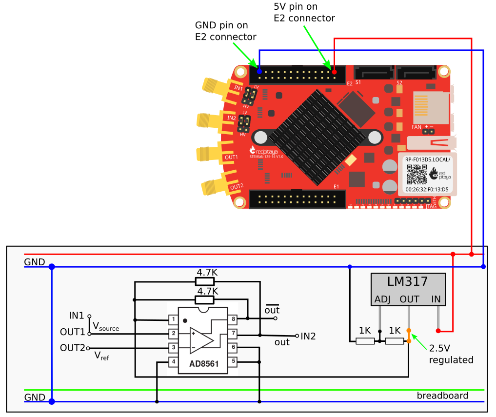

The Comparator, Positive Feedback and Schmitt Trigger
######################################################

Objective
__________

The objective of this activity is to investigate the voltage comparator, the use of positive feedback and the operation of the Schmitt Trigger configuration. The use of conventional operational amplifiers as a substitute for voltage comparators will described in basic op amp circuits section_. 

Notes
_____

.. _hardware: http://redpitaya.readthedocs.io/en/latest/doc/developerGuide/125-10/top.html
.. _here: http://redpitaya.readthedocs.io/en/latest/doc/developerGuide/125-14/extent.html#extension-connector-e2
.. _Oscilloscope: http://redpitaya.readthedocs.io/en/latest/doc/appsFeatures/apps-featured/oscSigGen/osc.html
.. _Signal: http://redpitaya.readthedocs.io/en/latest/doc/appsFeatures/apps-featured/oscSigGen/osc.html
.. _generator: http://redpitaya.readthedocs.io/en/latest/doc/appsFeatures/apps-featured/oscSigGen/osc.html
.. _AD8561: http://www.analog.com/media/en/technical-documentation/data-sheets/AD8561.pdf
.. _section: http://red-pitaya-active-learning.readthedocs.io/en/latest/Activity13_BasicOPAmpConfigurations.html#using-an-op-amp-as-a-comparator
.. _LM317: http://red-pitaya-active-learning.readthedocs.io/en/latest/Activity13_BasicOPAmpConfigurations.html#first-step-connecting-dc-power
.. _previus: http://red-pitaya-active-learning.readthedocs.io/en/latest/Activity13_BasicOPAmpConfigurations.html#first-step-connecting-dc-power

In this tutorials we use the terminology taken from the user manual when referring to the connections to the Red Pitaya STEMlab board hardware_.
Extension connector pins used for **-3.3V** and **+3.3V** voltage supply are show in the documentation here_. 
Oscilloscope_ & Signal_ generator_ application is used for generating and observing signals on the circuit.

Background
__________

The Voltage Comparator
-----------------------
A Differential Voltage Comparator such as the AD8561_ from the analog parts kit has a pinout similar in many ways to that of a conventional opamp but with many important differences (figure 1). There are the usual :math:`V_+` and :math:`V_-` power supply pins but a comparator will also have a ground (GND) pin as well. The differential :math:`+IN` and :math:`-IN` pins are essentially the same as a conventional op-amp. There will also be an output pin as in an opamp but there is often a second “inverting” ( or complementary ) output. Also, while the voltage at the output of an opamp can generally swing close to the :math:`+` and :math:`-` supply rails, the output of a comparator will swing only between ground(gnd) and the :math:`+` supply. This makes the output more like a digital signal and compatible with standard logic gates such as TTL or CMOS. The voltage comparator can be thought of as a single bit analog-to-digital converter (ADC). The AD8561 also includes a LATCH input which will latch or freeze the output and prevent it from changing even if the inputs change.

.. image:: img/Activity_18_Figure_1.png

Figure 1: AD8561_  datasheet and pin assignments 

Materials
----------

- Red Pitaya STEMlab 
- OPAMP:     1x AD8561_  voltage comparator
- Voltage regulator: 1x LM317
- Resistor:  2x 4.7 :math:`k \Omega`
- Resistor:  1x 20 :math:`k \Omega`
- Resistor:  1x 47 :math:`k \Omega`
- Resistor:  1x 100 :math:`k \Omega`
- Capacitor: 1x 0.1 :math:`\mu F`

Directions
-----------

Construct the comparator test circuit as shown in figure 2 on your solder-less breadboard. The two 4.7 kΩ pull-up resistors are optional and are used to increase the peak positive output swing to closer to the +5 V supply. 

Figure 2: AD8561_  comparator circuit

.. note:: 

   Voltage Comparators are extremely sensitive to the noise and glitches on the power supply rail. Noisy power supply rail will cause glitches on the output signal. This glitches will be present at switching threshold voltages. In other words, comparator will have some trouble deciding to switch on V+ or to V-  when comparing two input signals affected by the power supply noise. Because of that here we use a voltage regulator to stabilize our power supply rail and prevent noisy output from the comparator. 
   You can try directly using 5V power supply rail and observe the results and compare them with the results obtained using voltage regulator.
   Note: It is not necessary to drop down voltage from 5V to 2.5V but we chose that just form simplicity.

.. image:: img/Activity_18_Figure_3.png

Figure 3: AD8561_  comparator circuit on the breadboard

LM317_ Voltage regulator is described in previus_ section.

Procedure
----------