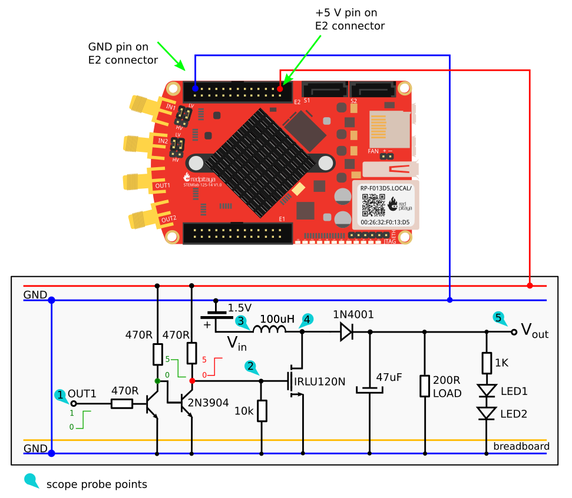

DC-DC Boost Converter
#########################

Objective
__________

Here we will explore an inductor based circuit which can produce an output voltage which is higher than the supplied voltage. This class of circuits are referred to as DC to DC converters or boost regulators. In this experiment the voltage from a 1.5 V supply ( battery ) will be boosted to a voltage high enough ( ~ 5 V) to drive two LEDs in series. **Note that forward voltage of LED is typically 1.8V although for some diodes it can go up to 3.3V (blue LED)**

Notes
_____

.. _hardware: http://redpitaya.readthedocs.io/en/latest/doc/developerGuide/125-10/top.html
.. _Oscilloscope: http://redpitaya.readthedocs.io/en/latest/doc/appsFeatures/apps-featured/oscSigGen/osc.html
.. _Signal: http://redpitaya.readthedocs.io/en/latest/doc/appsFeatures/apps-featured/oscSigGen/osc.html
.. _generator: http://redpitaya.readthedocs.io/en/latest/doc/appsFeatures/apps-featured/oscSigGen/osc.html
.. _here: http://redpitaya.readthedocs.io/en/latest/doc/developerGuide/125-14/extent.html#extension-connector-e2
.. _this Wikipedia article: https://en.wikipedia.org/wiki/Boost_converter
.. _IRLU120N: http://www.infineon.com/dgdl/irlr120n.pdf?fileId=5546d462533600a4015356695f642663
.. _1N4001: http://www.vishay.com/docs/88503/1n4001.pdf
.. _boost converter calculator: https://learn.adafruit.com/diy-boost-calc/the-calculator
.. _2N3904: https://www.sparkfun.com/datasheets/Components/2N3904.pdf

In this tutorials we use the terminology taken from the user manual when referring to the connections to the Red Pitaya STEMlab board hardware_.
Oscilloscope_ & Signal_ generator_ application is used for generating and observing signals on the circuit.
Extension connector pins used for **+5V**, **-3.3V** and **+3.3V** voltage supply are show in the documentation here_. 

Background Basics
__________________

Temporarily connect one of your LEDs from the 1.5 V battery. Be careful to note the polarity of the diode so it will be forward biased. Does it light up? Probably not since 1.5 V is generally not enough to turn on an LED. We need a way to boost the 1.5 V to a higher voltage to light a single LED let alone two LEDs connected in series. 

A boost converter (step-up converter) is a DC-to-DC power converter that steps up voltage (while stepping down current) from its input (supply) to its output (load). It is a class of switched-mode power supply (SMPS) containing at least two semiconductors (a diode and a transistor) and at least one energy storage element: a capacitor, inductor, or the two in combination. To reduce voltage ripple, filters made of capacitors (sometimes in combination with inductors) are normally added to such a converter's output (load-side filter) and input (supply-side filter).

.. note::     
    Theory of operation of DC - DC boost converter is nicely explained in `this Wikipedia article`_. Before going into experiment short overview of the theory is recommended.

Classical DC - DC boost converter circuit is shown on figure 1. Depending on the desired operating (switching) frequency and maximum current rating the inductor 
:math:`L_1` should be selected. In this experiment for :math:`L_1` an :math:`100 \mu H` power inductor with 1A current rating is used. Operating (switching) frequency should be in range of :math:`10 - 50  kHz`. For the rectifier :math:`D_1` and the snubber :math:`D_2` diodes classical 1N4001_ or a 1N3064 can be used. 
For the :math:`M_1` transistor we will use IRLU120N_. We selected this power MOSFET transistor since it has low threshold voltage :math:`V_{TH}`. If you use high threshold voltage FET transistors and low voltage driving  signal  (gate signal) the switching of the MOSFET could be non-optimal. Selected MOSFET already has snubber diode integrated so external diode :math:`D_2` is not necessary.  

.. note::

    Simple DC-DC `boost converter calculator`_  is also available on Adafruit web page.

For storage capacitor :math:`C_1` and electrolytic high capacitance capacitor should be selected. The selection of this capacitor depends on current ratings, switching frequency and inductor value. But to be on the safe side values above :math:`10 \mu F` would be sufficient.
An DC-DC boost converter used in this experiment is shown in figure 1.

Figure 1: DC to DC boost converter 

On figure 1 basic DC-DC boost converter circuit is shown. To the converter circuit a 200 :math:`\Omega` load is added. **For stable operation of DC-DC boost converter either constant load or load regulation is needed**. Without regulation any change of the load will affect the output voltage level. Therefore we have set 200 :math:`\Omega` load to stabilize output voltage. Parallel to the load two LED diodes in series with 1K resistors are added. Note that adding or removing additional LEDs parallel to the load will not affect output voltage since current drawn by LED will be much smaller than current drawn by 200 :math:`\Omega` load.
**LEDs are used as indicators that our DC battery voltage is BOOSTED UP form 1.5 V to ~5V.** If the LEDs are off that means our battery voltage is bellow LED forward voltage (2x1.8V) and therefore indicating that DC-DC boost converter circuit is not working correctly. 

Red Pitaya STEMlab outputs can generate voltage signals with maximal output range of +/- 1V (2Vpp). For MOSFET switching the higher signal amplitudes are required.Because of that we have used two NPN transistors in switching mode as intermediate stage between OUT1 switching signal and MOSFET transistor. OUT1 square signal will switch ON and OFF first NPN transistor causing its collector voltage to swing between 0-5V. This collector voltage then controls second NPN transistor and its collector voltage, also swinging between 0-5V, will then switch ON/OFF the MOSFET transistor.  
The reason why two NPN transistors are used is to have OUT1 and MOSFET gate signal in phase. I.e when OUT1 is high the signal on the MOSFET gate should be also high. Using one transistor will cause 180 phase delay.  **You can also see the other more important problem here. If we use only one NPN transistor then when OUT1 is constantly turned OFF the MOSFET transistor will be constantly turned ON producing short circuit: battery - inductor - mosfet - gnd**. Using two NPN transistor will prevent this happening. 

.. warning::
    Note that +5V voltage rail from the STEMlab is used only for transistor switching and not for the load supply. I.e electrical energy is flowing from battery to the LOAD and LEDs.  

Materials
__________

- Red Pitaya STEMlab 
- 1x 1kΩ Resistor
- 3x 470Ω Resistor
- 1x 10kΩ Resistor
- 1x :math:`100 \mu H` Power inductor 
- 1x :math:`47 \mu F` Capacitor 
- 2x LED (red)
- 1x 1W 200Ω Resistor 
- 1x Signal diode (1N4001_)
- 2x Small signal NPN transistor (2N3904_)
- 1x Power MOS transistor (IRLU120N_)
- 1x AA 1.5V battery
- 1x Solder-less Breadboard

Procedure
_____________

1.Following instructions above and schematics from figure 1 build the circuit on the breadboard.

.. image:: img/Activity_28_Figure_2.png

Figure 2: DC - DC boost converter on the breadboard

